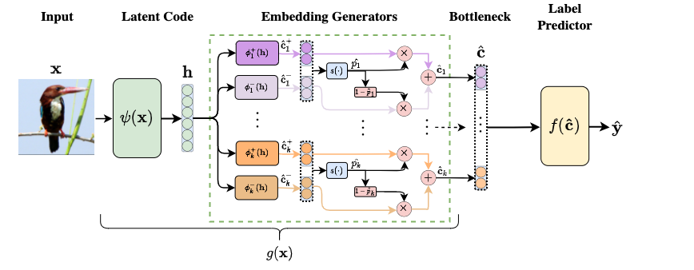

# Concept Embedding Models

This repository contains the official Pytorch implementation of our work
*"Concept Embedding Models"* accepted at **NeurIPS 2022**. For details on our
model and motivation, please refer to our official [paper](TODO).

# Model



[Concept Bottleneck Models (CBMs)](https://arxiv.org/abs/2007.04612) have recently gained attention as
high-performing and interpretable neural architectures that can explain their
predictions using a set of human-understandable high-level concepts.
Nevertheless, the need for a strict activation bottleneck as part of the
architecture, as well as the fact that one requires the set of concept
annotations used during training to be fully descriptive of the downstream
task of interest, are constraints that force CBMs to trade downstream
performance for interpretability purposes. This severely limits their
applicability in real-world applications, where data rarely comes with
concept annotations that are fully descriptive of any task of interest.


In our work, we propose Concept Embedding Models (CEMs) to tackle these two big
challenges. Our neural architecture expands a CBM's bottleneck and allows the
information related to unseen concepts to be flow as part of the model's
bottleneck. We achieve this by learning a high-dimensional representation
(i.e., a *concept embedding*) for each concept provided during training. Naively
extending the bottleneck, however, may directly impede the use of test-time
*concept interventions* where one can correct a mispredicted concept in order
to improve the end model's downstream performance. This is a crucial element
motivating the creation of traditional CBMs and therefore is a highly desirable
feature. Therefore, in order to use concept embeddings in the bottleneck while
still permitting effective test-time interventions, CEM
construct each concept's representation as a linear combination of two
concept embeddings, where each embedding has fixed semantics. Specifically,
we learn an embedding to represent the "active" space of a concept and one
to represent the "inactive" state of a concept, allowing us to selecting
between these two produced embeddings at test-time to then intervene in a
concept and improve downstream performance. Our entire architecture is
visualized in the figure above and formally described in our paper.

# Usage

In this repository, we include a standalone Pytorch implementation of CEM
which can be easily trained from scratch given a set of samples annotated with
a downstream task and a set of binary concepts. In order to use our implementation,
however, you first need to install all our code's requirements (listed in
`requirements.txt`). We provide an automatic mechanism for this installation using
Python's setup process with our standalone `setup.py`. To install our package,
therefore, you only need to run:
```bash
$ python setup.py install
```

After this command has terminated successfully, you should be able to import
`cem` as a package and use it to train a CEM object as follows:
```python
import pytorch_lightning as pl
from cem.models.cem import ConceptEmbeddingModel

#####
# Define your dataset
#####

train_dl = ...
val_dl = ...

#####
# Construct the model
#####

cem_model = ConceptEmbeddingModel(
  n_concepts=n_concepts, # Number of training-time concepts
  n_tasks=n_tasks, # Number of output labels
  emb_size=16,
  concept_loss_weight=0.1,
  learning_rate=1e-3,
  optimizer="adam",
  c_extractor_arch=latent_code_generator_model, # Replace this appropriately
  training_intervention_prob=0.25, # RandInt probability
)

#####
# Train it
#####

trainer = pl.Trainer(
    gpus=1,
    max_epochs=100,
    check_val_every_n_epoch=5,
)
# train_dl and val_dl are datasets previously built...
trainer.fit(cem_model, train_dl, val_dl)
```

# Experiment Reproducibility

To reproduce the experiments discussed in our paper, please use the scripts
in the `experiments` directory after installing the `cem` package as indicated
above. For example, to run our experiments on the DOT dataset (see our paper),
you can execute the following command:

```bash
$ python experiments/synthetic_datasets_experiments.py dot -o dot_results/
```
This should generate a summary of all the results after execution has
terminated and dump all results/trained models/logs into the given
output directory (`dot_results/` in this case).


# Citation
If you would like to cite this repository, or the accompanying paper, please
use the following citation:

```
@article{DBLP:journals/corr/abs-2111-12628,
  author    = {Mateo Espinosa Zarlenga and
            Pietro Barbiero and
            Gabriele Ciravegna and
            Giuseppe Marra and
            Francesco Giannini and
            Michelangelo Diligenti and
            Zohreh Shams and
            Frederic Precioso and
            Stefano Melacci and
            Adrian Weller and
            Pietro Lio and
            Mateja Jamnik},
  title     = {Concept Embedding Models},
  journal   = {CoRR},
  volume    = {abs/TODO},
  year      = {2021},
  url       = {https://arxiv.org/abs/TODO},
  eprinttype = {arXiv},
  eprint    = {TODO},
  timestamp = {TODO},
  biburl    = {https://dblp.org/rec/journals/corr/abs-TODO.bib},
  bibsource = {dblp computer science bibliography, https://dblp.org}
}
```
